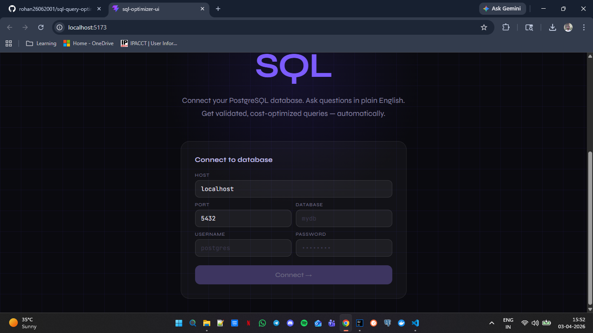
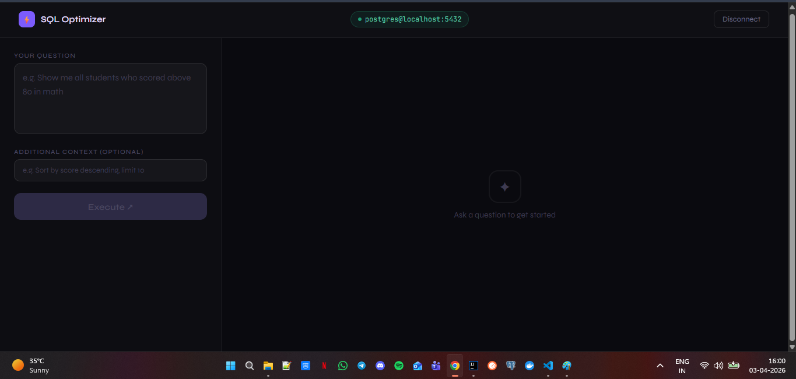

# 🧠 AI-Powered SQL Query Optimizer

A full-stack application that converts **natural language** into validated, optimized PostgreSQL queries using **Ollama LLM**, **Apache Calcite**, **VolcanoPlanner**, and a **React UI**.

---

## 🎥 Demo

> 📹 **Watch the full walkthrough:**

[](demo/video.mp4)

> _Click the image above to watch the demo video, or open `demo/video.mp4` directly._

---

## 📸 Screenshots

### Landing Page — Connect to Database


### Execute Page — Query Results


---

## 📌 What It Does

You type a question in plain English. The system:
1. Connects to your PostgreSQL database
2. Reads the live schema
3. Generates a SQL query using a local LLM (Llama3 via Ollama)
4. Validates the query against the real schema using Apache Calcite
5. Auto-rectifies hallucinated tables/columns (up to 3 attempts)
6. Optimizes the query using VolcanoPlanner (cost-based optimizer)
7. Explains what was optimized and why
8. Executes and returns the result as a formatted table

---

## 🖥️ UI Features

The React frontend (built with Vite) provides:

- **Landing page** — connect to any PostgreSQL database with host/port/credentials
- **Execute page** — type natural language questions, see results instantly
- **AI Generated Query** — the raw SQL the LLM produced
- **Optimized Query** — the VolcanoPlanner rewritten version
- **Cost breakdown** — original vs optimized rows/cpu/io side by side
- **LLM Explanation** — plain English summary of what changed and why
- **Result table** — formatted ASCII table rendered directly in the browser

### Running the UI

```bash
cd sql-optimizer-ui
npm install
npm run dev
```

Open **http://localhost:5173** in your browser.

> The UI communicates with the Spring Boot backend on port **8080**. Make sure the backend is running first.

---

## 🏗️ Architecture

```
┌─────────────────────────────────────────────────────────────────┐
│                        REST API Layer                           │
│              POST /execute       POST /db/connect               │
└────────────────────────┬────────────────────────────────────────┘
                         │
                         ▼
┌─────────────────────────────────────────────────────────────────┐
│                       BaseService                               │
│   Orchestrates the full pipeline end-to-end                     │
└───┬─────────────┬──────────────┬──────────────┬────────────────-┘
    │             │              │              │
    ▼             ▼              ▼              ▼
┌────────┐  ┌─────────┐  ┌──────────┐  ┌────────────┐
│QueryGen│  │Validator│  │Optimizer │  │  Executor  │
│AiSvc   │  │Service  │  │Service   │  │  Service   │
└───┬────┘  └────┬────┘  └─────┬────┘  └─────┬──────┘
    │            │             │             │
    ▼            ▼             ▼             ▼
┌────────┐  ┌──────────────────────────┐  ┌──────────┐
│ Ollama │  │      CalcitePlanner      │  │ HikariCP │
│ LLM    │  │  validate() + optimize() │  │   Pool   │
│(Llama3)│  └──────────────────────────┘  └──────────┘
└────────┘
```

---

## 🔄 Full Request Pipeline

```
User: "Show me students who scored above 80"
         │
         ▼
  ┌─────────────────┐
  │  QueryGenAiSvc  │  ──► Reads live schema from DB
  │  generateQuery()│  ──► Sends to Llama3 via Ollama
  └────────┬────────┘
           │
           │  SELECT s.name FROM students s
           │  JOIN marks m ON s.id = m.student_id
           │  WHERE m.score > 80
           ▼
  ┌──────────────────────────────────────────┐
  │         QueryValidatorService            │
  │                                          │
  │  attempt 1 ──► CalcitePlanner.validate() │
  │       │                                  │
  │       ├── ✅ valid → proceed             │
  │       └── ❌ invalid → rectifyQuery()    │
  │                   │                      │
  │  attempt 2 ──► CalcitePlanner.validate() │
  │  attempt 3 ──► CalcitePlanner.validate() │
  │       └── ❌ all failed → throw error    │
  └────────┬─────────────────────────────────┘
           │  validated SQL ✅
           ▼
  ┌──────────────────────────────────────────┐
  │         QueryOptimizerService            │
  │                                          │
  │  SQL → RelNode (logical plan)            │
  │  JdbcTableScan → LogicalTableScan        │
  │  VolcanoPlanner explores transformations │
  │  Picks lowest cost plan                  │
  │  RelNode → optimized SQL                 │
  └────────┬─────────────────────────────────┘
           │  optimized SQL
           ▼
  ┌──────────────────────────────────────────┐
  │         QueryExecutorService             │
  │  Runs on PostgreSQL via HikariCP         │
  │  Returns formatted tabular result        │
  └────────┬─────────────────────────────────┘
           │
           ▼
  ┌──────────────────────────────────────────┐
  │              UserOutput                  │
  │  - userInput (original question)         │
  │  - aiGeneratedQuery (raw LLM output)     │
  │  - optimizedSqlQuery                     │
  │  - originalCost (rows, cpu, io)          │
  │  - optimizedCost (rows, cpu, io)         │
  │  - costDifference                        │
  │  - whatIsOptimized (LLM explanation)     │
  │  - resultSet (formatted table)           │
  └──────────────────────────────────────────┘
```

---

## ✅ Validation & Rectification Loop

```
                    ┌──────────────────────┐
                    │  AI Generated Query  │
                    └──────────┬───────────┘
                               │
                    ┌──────────▼───────────┐
                    │  CalcitePlanner      │
                    │  .validate(sql)      │
                    └──────────┬───────────┘
                               │
                    ┌──────────▼───────────┐
              ┌─YES─┤   Valid? (null err)  │
              │     └──────────┬───────────┘
              │                │ NO
              │     ┌──────────▼───────────┐
              │     │  attempts-- (max 3)  │
              │     └──────────┬───────────┘
              │                │
              │     ┌──────────▼───────────┐
              │     │  rectifyQuery()      │
              │     │  (LLM + error msg)   │
              │     └──────────┬───────────┘
              │                │
              │     ┌──────────▼───────────┐
              │     │  attempts == 0?      ├─YES─► throw RuntimeException
              │     └──────────┬───────────┘
              │                │ NO → loop back
              ▼
    Validated AiGeneratedQuery ✅
```

---

## ⚙️ Optimization Pipeline (Apache Calcite VolcanoPlanner)

```
Validated SQL
      │
      ▼
  Parse + Validate
  (Calcite Planner)
      │
      ▼
  RelNode Tree
  (JDBC convention)
  ┌─────────────────────┐
  │ JdbcTableScan       │
  │   └── JdbcProject   │
  │         └── Filter  │
  └─────────────────────┘
      │
      ▼
  Convert to Logical Tree
  (RelShuttleImpl)
  ┌──────────────────────────┐
  │ LogicalTableScan (NONE)  │
  │   └── LogicalProject     │
  │         └── LogicalFilter│
  └──────────────────────────┘
      │
      ▼
  VolcanoPlanner
  ┌──────────────────────────────────────────┐
  │  Registers 50+ CoreRules:                │
  │  • FILTER_INTO_JOIN  (push filters down) │
  │  • JOIN_COMMUTE      (reorder joins)     │
  │  • PROJECT_REMOVE    (drop unused cols)  │
  │  • AGGREGATE_REMOVE  (remove redundant)  │
  │  • ... and many more                     │
  │                                          │
  │  Explores all valid transformations      │
  │  Scores each by (rows × cpu × io) cost  │
  │  Picks the minimum cost plan             │
  └──────────────────────────────────────────┘
      │
      ▼
  Optimized RelNode
      │
      ▼
  Strip JdbcToEnumerableConverter
  (RelShuttleImpl cleanup)
      │
      ▼
  RelToSqlConverter
      │
      ▼
  Optimized PostgreSQL SQL ✅

  Cost Report:
  ┌─────────────────────────────────────────┐
  │  Original:  rows=3200, cpu=2452, io=0   │
  │  Optimized: rows=750,  cpu=750,  io=0   │
  │  Saved:     rows=2450, cpu=1702, io=0   │
  └─────────────────────────────────────────┘
```

---

## 🗂️ Project Structure

```
.
├── sql-optimizer-backend/                  ← Spring Boot
│   └── src/main/java/com/rohan/sql_query_optimizer/
│       ├── controller/
│       │   ├── BaseController.java         # POST /execute
│       │   └── DBController.java           # POST /db/connect, GET /db/close
│       │
│       ├── service/
│       │   ├── BaseService.java            # Orchestrates full pipeline
│       │   ├── calcite/
│       │   │   ├── CalcitePlanner.java     # Core: validate() + optimize()
│       │   │   ├── QueryValidatorService.java
│       │   │   └── QueryOptimizerService.java
│       │   ├── db/
│       │   │   ├── DBConnectionManager.java
│       │   │   └── DBService.java
│       │   ├── query/
│       │   │   ├── QueryGenAiService.java
│       │   │   └── QueryExecutorService.java
│       │   └── schema/
│       │       └── SchemaService.java
│       │
│       ├── dto/
│       │   ├── ai/AiGeneratedQuery.java
│       │   ├── calcite/OptimizedQuery.java
│       │   ├── db/DatabaseConnectionRequest/Response.java
│       │   └── user/UserInput/UserOutput.java
│       │
│       ├── utils/
│       │   └── ResultSetUtil.java
│       │
│       └── resources/
│           ├── prompts/
│           │   ├── query_generation_prompt.txt
│           │   ├── query_rectifier_prompt.txt
│           │   └── query_difference_prompt.txt
│           └── application.properties
│
├── sql-optimizer-ui/                       ← React + Vite
│   ├── src/
│   │   ├── App.jsx                         # Full UI — landing + execute pages
│   │   ├── main.jsx
│   │   └── index.css
│   ├── index.html
│   ├── vite.config.js
│   └── package.json
│
└── assets/                                 ← Screenshots & demo video
    ├── screenshot-landing.png              ← replace with your screenshot
    ├── screenshot-execute.png             ← replace with your screenshot
    ├── thumbnail.png                       ← replace with your video thumbnail
    └── demo.mp4                            ← replace with your demo video
```

---

## 🚀 Getting Started

### Prerequisites

| Tool | Version |
|---|---|
| Java | 21+ |
| Maven | 3.9+ |
| Node.js | 18+ |
| PostgreSQL | Any |
| Ollama | Latest |

### 1. Install and Start Ollama

```bash
# Install Ollama (https://ollama.com)
ollama pull llama3
ollama serve
```

### 2. Configure `application.properties`

```properties
spring.ai.ollama.base-url=http://localhost:11434
spring.ai.ollama.chat.options.model=llama3
spring.ai.ollama.chat.options.temperature=0.2
spring.ai.ollama.chat.options.top-p=0.9
spring.ai.ollama.chat.options.num-predict=512
```

### 3. Run the Backend

```bash
cd sql-optimizer-backend
mvn spring-boot:run
```

### 4. Run the Frontend

```bash
cd sql-optimizer-ui
npm install
npm run dev
```

Open **http://localhost:5173** in your browser.

---

## 📡 API Reference

### Connect to Database
```http
POST /db/connect
Content-Type: application/json

{
  "host": "localhost",
  "port": "5432",
  "database": "mydb",
  "username": "postgres",
  "password": "secret"
}
```

### Execute Natural Language Query
```http
POST /execute
Content-Type: application/json

{
  "userMessage": "Show me students who scored above 80",
  "additionalInputs": ""
}
```

### Sample Response
```json
{
  "userInput": "Show me students who scored above 80",
  "aiGeneratedQuery": "SELECT s.name FROM students s JOIN marks m ON s.id = m.student_id WHERE m.score > 80",
  "optimizedSqlQuery": "SELECT s.name FROM marks m JOIN students s ON s.id = m.student_id WHERE m.score > 80",
  "originalCost": { "rows": 3200.0, "cpu": 2452.0, "io": 0.0 },
  "optimizedCost": { "rows": 750.0, "cpu": 750.0, "io": 0.0 },
  "costDifference": { "rows": 2450.0, "cpu": 1702.0, "io": 0.0 },
  "whatIsOptimized": "The JOIN order was swapped to start from the smaller marks table, reducing intermediate row count significantly.",
  "resultSet": "+--------+\n| name   |\n+--------+\n| Alice  |\n| Bob    |\n+--------+\n"
}
```

### Close Connection
```http
GET /db/close
```

---

## 🛠️ Tech Stack

| Layer | Technology |
|---|---|
| Backend Framework | Spring Boot 4.x |
| Frontend | React 18 + Vite |
| AI / LLM | Spring AI + Ollama (Llama3) |
| SQL Validation | Apache Calcite 1.37.0 |
| Query Optimization | Calcite VolcanoPlanner (cost-based) |
| Connection Pool | HikariCP 7.x |
| Database | PostgreSQL |
| Boilerplate | Lombok |

---

## 💡 Key Design Decisions

**Why Apache Calcite for validation?**
Calcite validates SQL against the live schema without executing it. This catches hallucinated table/column names before they hit the database — much safer and faster than running the query and catching SQL exceptions.

**Why VolcanoPlanner over HepPlanner?**
VolcanoPlanner is a cost-based optimizer — it scores every possible plan transformation by estimated rows, CPU, and I/O, and picks the cheapest one. HepPlanner is rule-based and applies rules in order without cost awareness.

**Why convert JDBC nodes to Logical nodes before optimizing?**
`JdbcSchema` produces `JdbcTableScan` nodes (JDBC convention). VolcanoPlanner targeting `NONE` convention can't bridge between them without explicit converter rules. Converting to `LogicalTableScan` first puts everything in `NONE` convention so the planner can freely apply all Core rules.

**Why HikariCP pool instead of a raw connection?**
Raw connections go stale on network drops, timeouts, or server restarts. HikariCP automatically validates, recycles, and manages connections — critical for a long-running server application.

---

## 👨‍💻 Author

Built by **Rohan** — a hands-on deep-dive into LLM-powered query generation, Apache Calcite internals, cost-based query optimization, and full-stack React development.